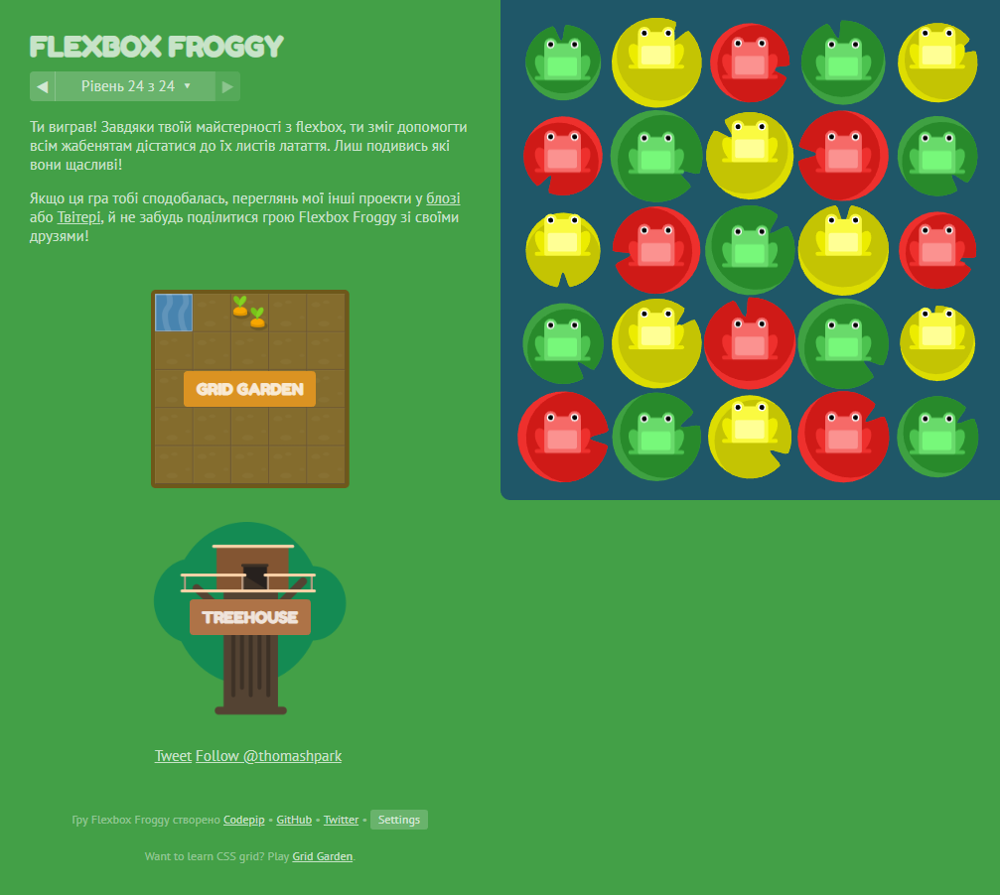

# kottans-frontend  :smile_cat:

## 0.Git Basics

---

## 1.Linux, Command Line, HTTP Tools

---

## 3.Intro to HTML & CSS

---

## 4.Responsive Web Design

---

## 4.HTML & CSS Practice

[Demo](https://shramkoweb.github.io/html/)

[Code base](https://github.com/Shramkoweb/html)

Checked my code in validator & BEM html tree

---
